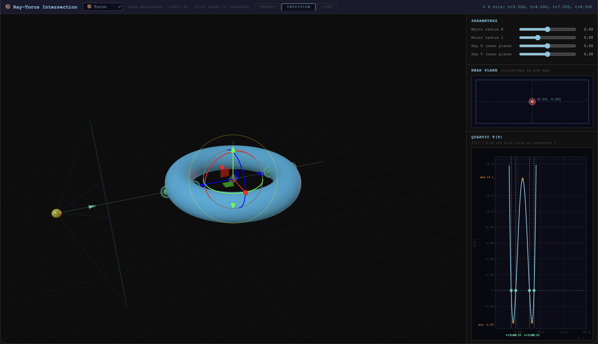

# Ray–Surface Intersection Explorer

An interactive learning tool for the mathematics at the heart of every ray tracer:
*"does this ray hit this object, and if so, where?"*

**[→ Open the live demo](https://andeplane.github.io/Raytracing/)**



---

## What it does

Choose a geometry — **sphere**, **cylinder**, or **torus** — and explore ray–surface intersection across three lenses:

| Tab | What you see |
|---|---|
| **Theory** | Step-by-step mathematical derivation: implicit surface F(**p**) = 0, ray substitution, polynomial coefficients, surface normal = ∇F |
| **Intuition** | Drag a ray interactively and watch the intersection polynomial update live in 3D and on a graph |
| **Code** | A live GLSL fragment shader editor — edit the three intersection functions and the scene recompiles in real time |

The torus is the centrepiece because it produces a **degree-4 (quartic)** polynomial — a ray can pierce it at up to four points — making it the richest analytic case before you reach general implicit surfaces.

---

## The core idea

Every analytic ray–surface intersection follows the same three steps:

1. **Write** the implicit surface equation F(**p**) = 0
2. **Substitute** the ray **P**(t) = **O** + t**D** → polynomial f(t) = 0
3. **Find** the smallest positive root → evaluate **N** = normalize(∇F) at the hit

| Surface | F(**p**) = 0 | Polynomial degree |
|---|---|---|
| Sphere | **p**·**p** − R² | quadratic |
| Cylinder | p_x² + p_z² − R² | quadratic |
| Torus | (‖**p**‖² + R² − r²)² − 4R²(p_x² + p_z²) | **quartic** |

---

## Running locally

```bash
git clone https://github.com/andeplane/Raytracing.git
cd Raytracing
npm install
npm run dev        # dev server at http://localhost:5173
```

Other commands:

```bash
npm run build          # production build → dist/
npm run test           # Vitest unit tests
npm run lint           # ESLint
npm run typecheck      # tsc --noEmit
```

---

## Coding task

[`Task.md`](Task.md) contains a structured hands-on task that guides students through:

- **Deriving** the implicit equations and polynomial coefficients on paper
- **Implementing** the results in GLSL and watching them render in real time
- **Experimenting** with numerical methods (scan + bisect vs. Newton's method)

It covers cylinder (quadratic) and torus (quartic), with the sphere provided as a worked example.

---

## Tech stack

- **TypeScript** + **Vite**
- **Three.js** — 3D scene (Intuition + Theory tabs)
- **WebGL2 / GLSL** — live shader editor (Code tab)
- **KaTeX** — equation rendering in the Theory tab
- **Vitest** — unit tests for the math layer

---

## Deployment

The app is deployed to GitHub Pages via a GitHub Actions workflow on every push to `main`.
